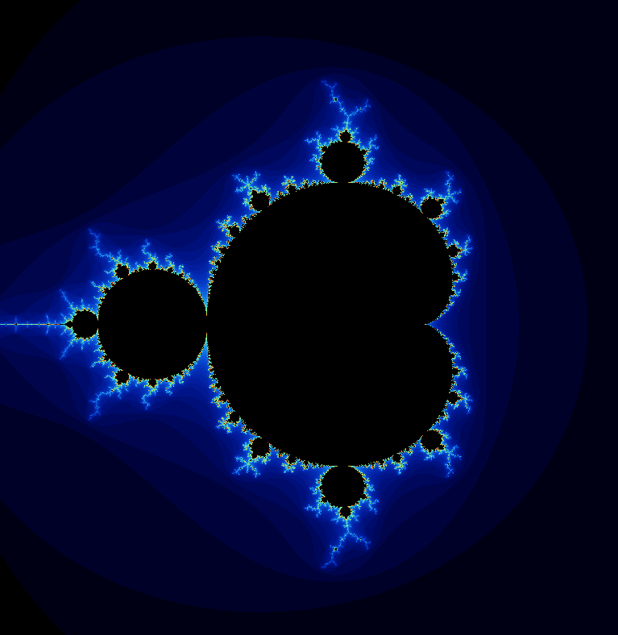
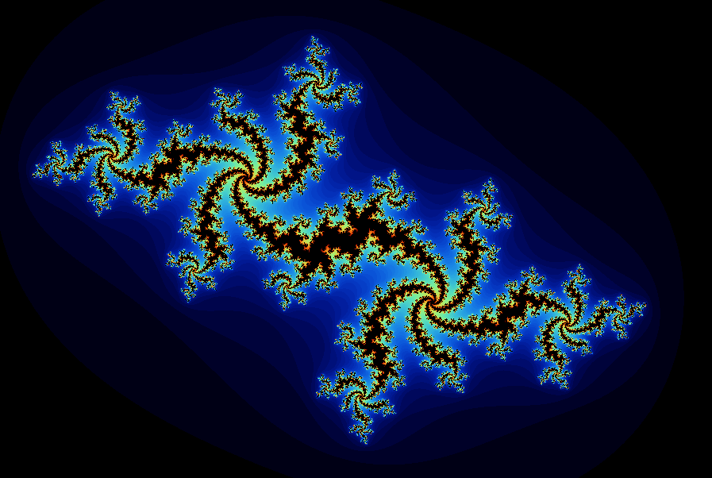
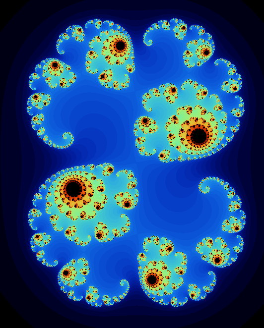
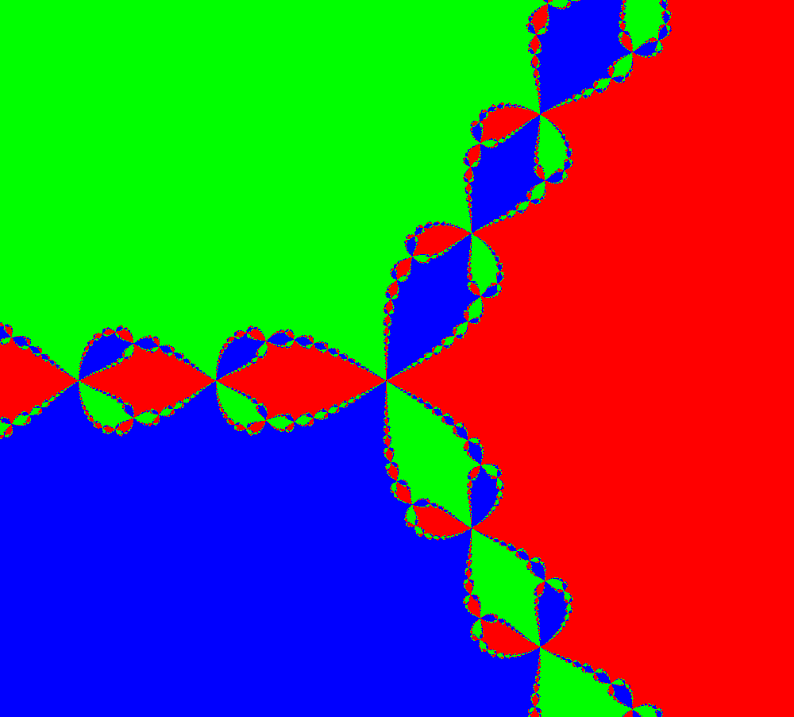
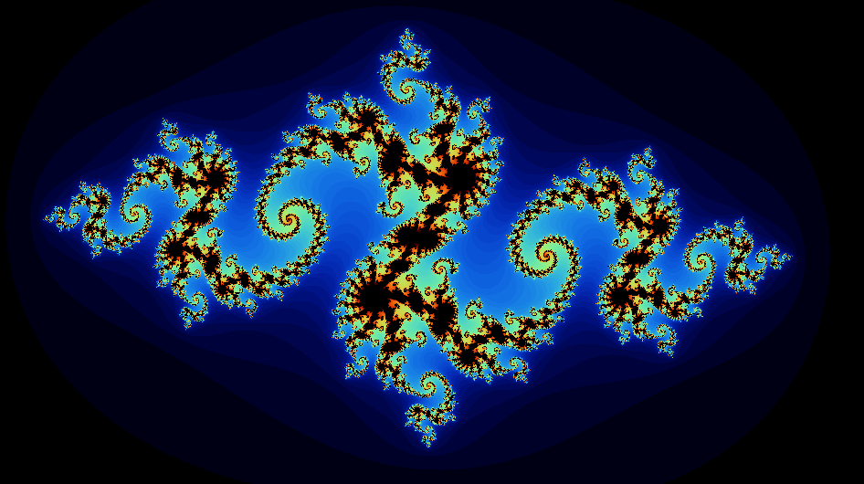
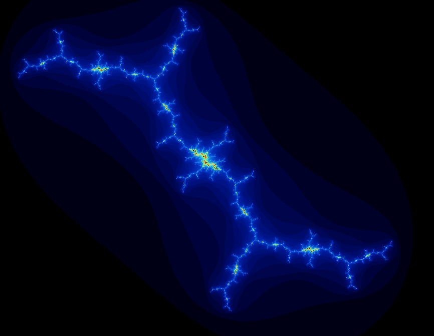
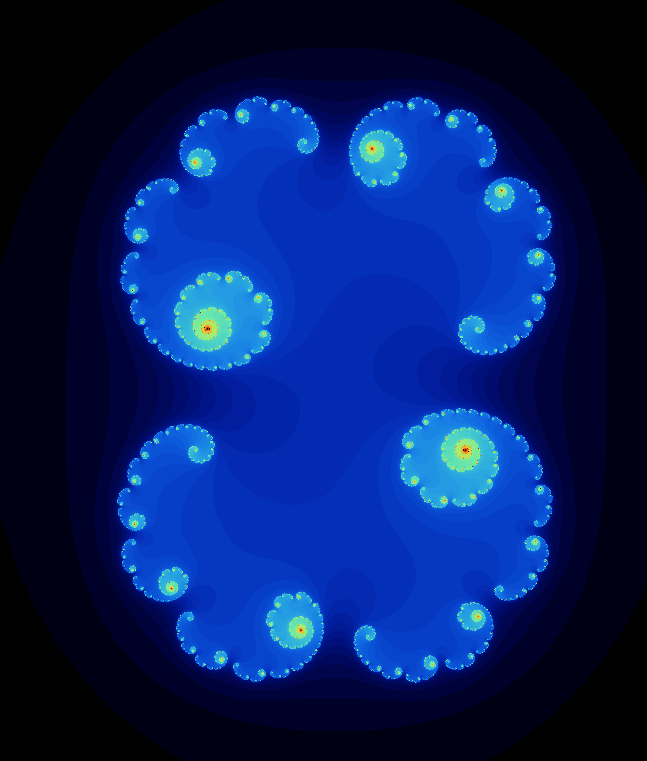
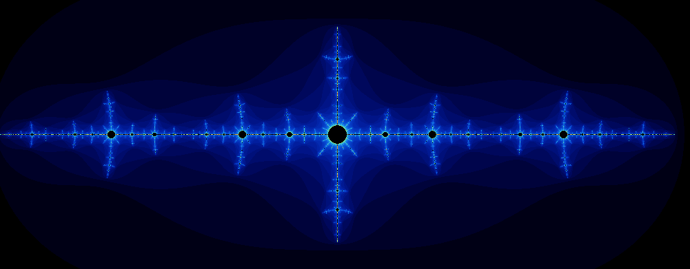
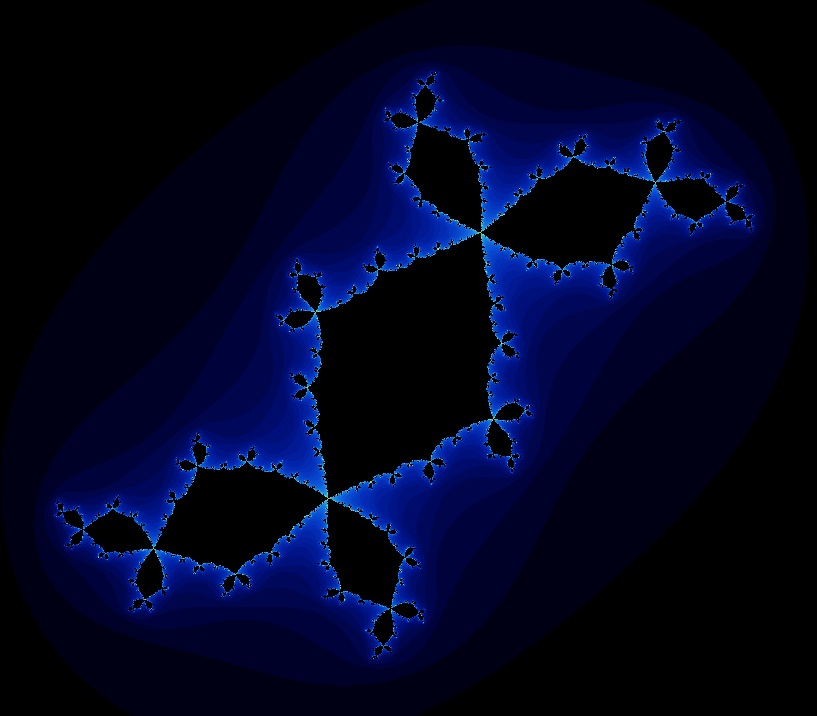
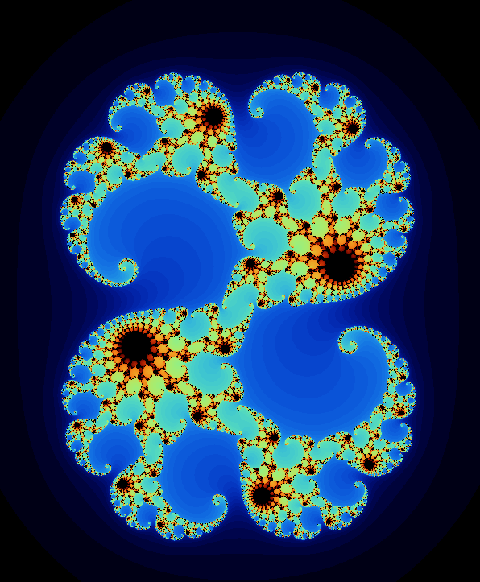

# Fract'ol
Fract'ol is a project developed as part of the curriculum at École 42. It's a graphical application that allows users to explore various types of fractals in real-time.

### Language : 

### Overview
Fract'ol generates and displays fractal images using the GPU and provides interactive controls for users to navigate and manipulate the fractals. It supports rendering multiple types of fractals, including the Mandelbrot set, Julia set, and more.

### Features
Real-time rendering of fractal images.
Support for various types of fractals, including the Mandelbrot set, Julia set, Burning Ship, and more.
Zooming and panning functionalities to explore fractals in detail.
Customizable color schemes and rendering parameters.
Multithreaded rendering for improved performance on multi-core processors.

### Usage
#### Compilation
To compile the Fract'ol program, run the following command:

First :
go in the mini-libx and :

```shell
make
```
to create the minilibx library.

Second:
return to the project directory
```shell
make
```
Third:
```shell
make bonus
```
Now every executable are ready.

#### Execution:
To execute the program, run the following command:

```shell
./fractol [fractal_type]
```
[fractal_type] with one of the supported fractal types (e.g., mandelbrot, julia, burning_ship).

For me it's:
```shell
>$ ./fractol
Les differentes commandes sont:
Mandel
Julias
Julias X.XXX X.XXX
```

```shell
>$ ./fractol Mandel
```
This command will lauch the Mandelbrot's fractal : 

```shell
>$ ./fractol Julias
```
This command will lauch the Julias's fractal :


```shell
>$ ./fractol Julias 0.285 0.01
```
This command will lauch the Julias's fractal on the point : 0.285, 0.01 :


#### Controls
* Use the arrow keys or mouse to navigate the fractal.
* Use the mouse scroll or keypad +/- keys to zoom in and out. (if it's not in bonus you just zoom in the center)
* Press ESC to exit the program.

For Julias's fractal (same as Mandelbrot's fractal but i have added one feature):
* Click on the screen to change the point and change the fractal.

#### Execution bonus
It's the same as before but now I have added the Newton fractal.

```shell
>$ ./fractol_bonus
Les differentes commandes sont:
Mandel
Julias
Julias X.XXX X.XXX
Newton
```

```shell
>$ ./fractol_bonus Mandel
```
Give the same result just like the mandatory part.
```shell
>$ ./fractol_bonus Julias
```
Give the same result just like the mandatory part.
```shell
>$ ./fractol_bonus Julias 0.285 0.01
```
Give the same result just like the mandatory part.
```shell
>$ ./fractol_bonus Newton
```


#### Controls bonus
The controls are the same but I have added a two features:
* Press S to switch color schemes.
* you can zoom on the position of your cursor.

### Different Julias Fractal to try: 

x      |   y    |  image
:-----:|:------:|:---------:
-0.79  | 0.15   | 
-0.162 | 1.04   | 
0.3    | -0.01  | 
-1.476 | 0.0    | 
-0.12  | -0.77  | 
0.28   | 0.008  |  
